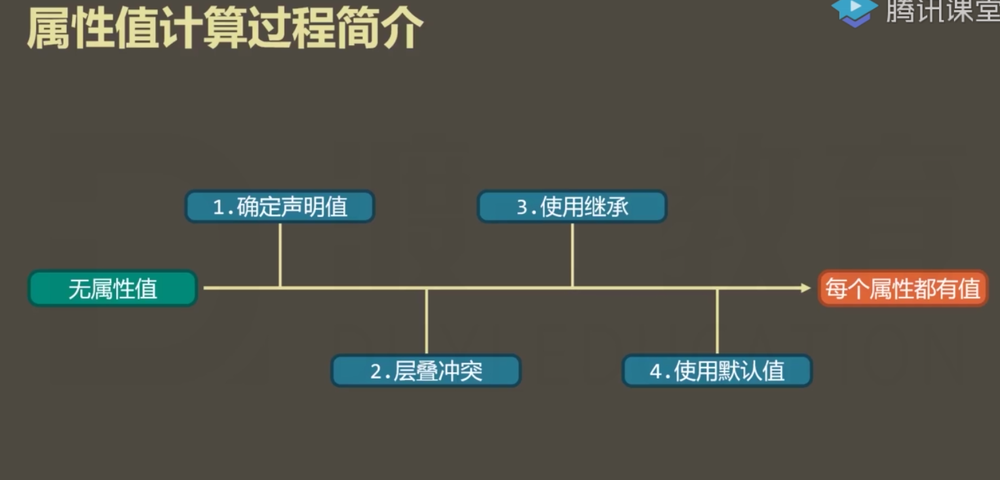
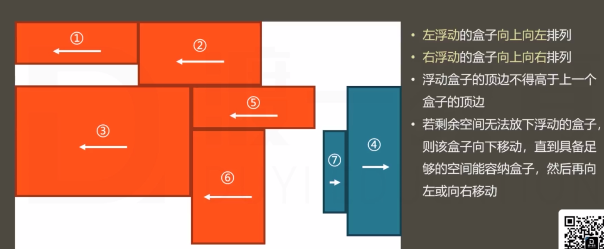
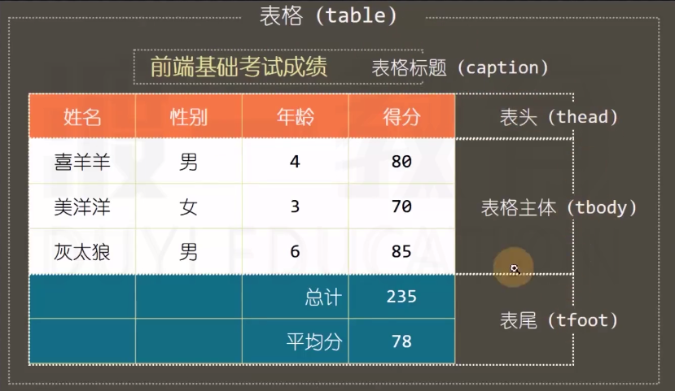
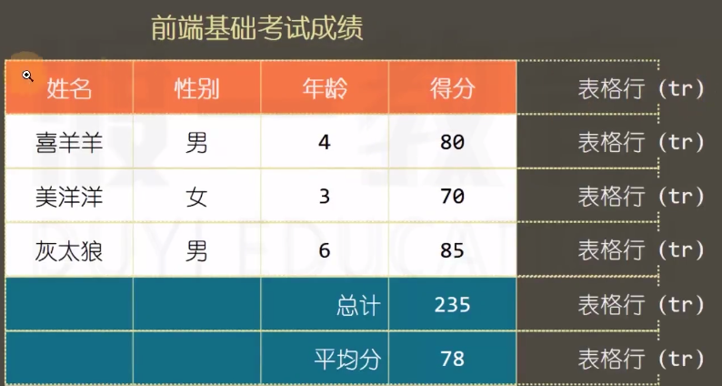
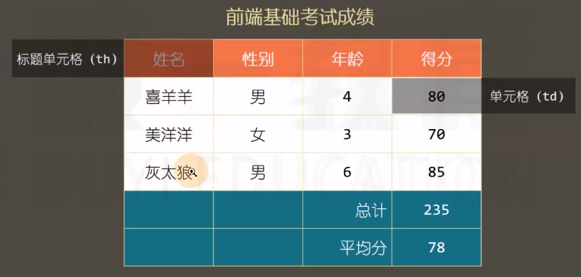
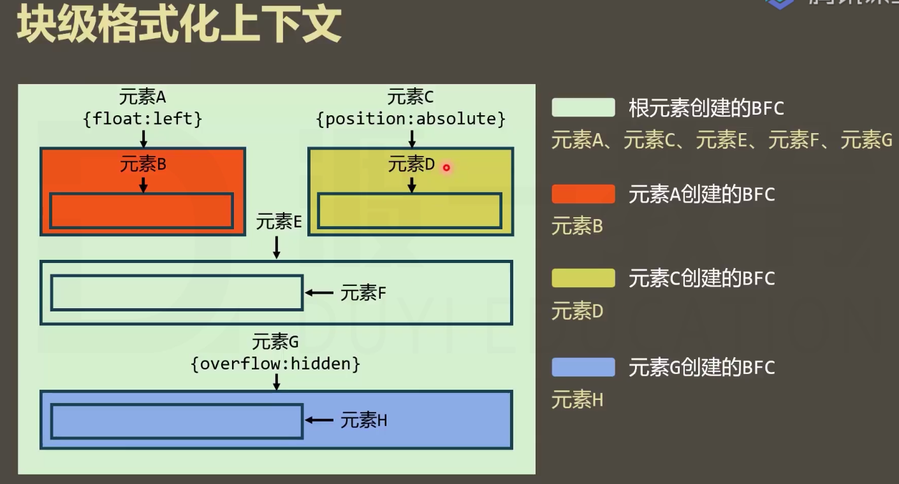

# 语义化

## 什么是语义化

1 每一个HTML元素都有具体的含义

a元素 ：超链接

p元素：段落

h1元素：一级标题

2.所有元素与展示效果无关

元素展示到页面中有什么效果，由css决定

**重要：选择什么元素，取决于内容的含义，而不是显示出的效果**
## 为什么需要语义化？
1.为了搜索引擎优化（SEO）
 搜索引擎：百度，搜狗，bing ，google
 每隔一段时间，搜索引擎会从整个互联网中，抓取页面源码

2.为了让浏览器理解网页

阅读模式 、语音模式


# 文本元素

HTML5支持的那些文本元素：[HMTL5元素周期表](http://www.xuanfengge.com/funny/html5/element/)

## h
h1-h6：表示1级标题 到 6级标题

## p  
段落
>乱数假文 lorem

## span【无语义】
没有语义，仅用于设置样式
>以前：某些元素在显示时会独占一行（块级元素），而某些元素不会（行级元素）
>html5中已经弃用了这中说法，因为语义化==》元素只代表内容，与显示无关

##pre
预格式化文本
空白折叠：在源代码中的连续空白字符，在显示时会被折叠成一个空格

例外：在pre元素中的内容不会出现空白折叠，在pre元素中出现的内容会按源码显示

pre元素通常用于显示一些代码。

pre元素功能的本质：他有一个css属性控制 white-space:pre 其他元素加上这个css属性也可以无空白折叠

一般会在pre元素外加上code标签，因为code标签是语义化标签，而pre元素官方并未说明是语义化元素

#实体字符
通常用于在页面中系那是一些特殊符号

1. &单词
2. &#数字

[实体字符](https://developer.mozilla.org/en-US/docs/Glossary/Entity)

# a元素

超链接

## href属性

hyper reference：通常表示跳转地址

1. 普通连接
2. 锚链接  #后面不加东西表示回到顶部 #test 表示跳到id为test的元素位置
   id属性：全局属性，表示元素在文档中的唯一编号
3. 功能连接
   点击后，触发某个功能
   + 执行js代码 javascript:
   + 发送邮件 mailto:  要求用户计算机上安装有邮件发送软件：exchange
   + 拨打电话 tel: 要求用户计算机上安装有拨号软件，或者使用的是移动端访问

## target属性
表示跳转的位置，默认为当前窗口

+ _self :在当前页面中打开
+ _blank:在新窗口中打开

## title属性
 全局属性 鼠标移上去之后的提示文字

#路径的写法

##站内资源和站外资源
+ 站内资源：当前网站的资源
+ 站外资源：非当前网站的资源

## 绝对路径和相对路径
+ 站外资源使用绝对路径
+ 站内资源使用相对路径（也可以使用绝对路径，不建议）

###绝对路径的书写格式：url地址
```
协议名://主机名:端口号/路径
schema://host:port/path
```

+ 协议名: http https file ftp
+ 主机名: 域名、IP地址
+ 端口号：http默认80、https默认443

### 相对路径

+ 以./开头，./表示当前资源所在的目录
+ ../表示上一级
+ 相对路径中 ./可以省略


# img元素
image缩写 空元素

##src属性：source
##alt属性：
当图片资源失效的时候，将使用该属性的文字替代图片

##与a元素联合使用
```
<a>   </a>
```
##与map元素联合使用

```html
<a> 

</a>

<map name ="solarMap">
 <area shape ="circle" coords ="" href ="" alt="" target = "_blank">
 <area shape ="rect" coords ="" href ="">
</map>

```
##与figure元素使用

+ 指代、定义，通常用于把图片、图片标题、描述包裹起来
+ 子元素：figcaption ：标题
```html
 <figure>
            <a href="">
                
            </a>
            <figcaption>
                <h2>太阳系</h2>
            </figcaption>
            <p>太阳系是以太阳为中心</p>
        </figure>
```

#媒体元素 
+ video
+ audio

##src属性
##controls
 控制控件的显示，取值只能为controls

某些属性，只有两种状态，不写或者值为属性名，这中属性叫做bool属性，在html5中可以不写属性值
##autoplay
bool属性：自动播放
##muted
bool属性：静音播放  有些网站的设置不允许自动播放，加上这个属性之后，就可以静音播放
##loop
bool属性：循环播放
##兼容性
1. 旧版本的浏览器不支持这两个元素， 因为这是h5元素------一般用文字提示不支持视频
2. 不同版本的浏览器支持的视频格式不同-------  一般使用source元素 
```html
   <video controls autoplay>
        <source src="">
        <source src="">
        <p>
            对不起，您的浏览器不支持
        </p>
    </video>
```

# 列表元素

## 有序列表
1. 如果只是为了显示内容，应用css属性list-style-type控制，而不是利用type控制
2. ol : ordered list
3. li : list item

## 无序列表
1. 经常用于菜单 和新闻列表
2. ul : unordered list
3. li : list item

## 定义列表
1. 通常用于一些术语的定义
2. dl : definition list 定义列表
3. dt : definition title 标题
4. dd : definition description 描述

# 容器元素
该元素内部代表一个区域，内部可以放置其他元素
## 无语义元素
1. div元素

## 语义元素
1. header ：通常用于表示页头，也可以用于表示文章的头部
2. footer : 通常用于表示页脚，也可以用于表示文章的底部
3. article：通常用于表示整篇文章
4. section：通常用于表示文章的章节
5. aside  ：通用用于表示附加信息，多用于侧边栏
6. nav    ：通常用于表示导航菜单

# 元素包含关系
以前：块级元素可以包含行级元素，行级元素不可以包含块级元素，a元素除外。

现在：没有了块级元素，行级元素的说法、元素的包含关系由元素的内容类别决定，其规则非常复杂。查找方式，mdn上看标签的允许内容

总结：

1. 容器元素中可以包含任何元素
2. a元素中几乎可以包含任何元素
3. 某些元素有固定的子元素(ul>li;ol>li) 
4. 标题元素和段落元素不能相互嵌套，并且不能包含容器元素

# 常见的重置样式表
1. [ormalize.css](http://necolas.github.io/normalize.css/)
2. [reset.css](https://meyerweb.com/eric/tools/css/reset/)
3. [meyer.css](https://meyerweb.com/eric/tools/css/reset/index.html)

# 层叠(权重计算，解决冲突)
1. 比较重要性(作者指开发者)
  1. 作者样式表中的!important
  2. 作者样式表的中的普通样式
  3. 浏览器默认样式
2. 比较特殊性(权重)
  1. 内联样式 1000
  2. id 100
  3. class 属性 伪类 10
  4. 元素 伪元素  1
  5. \* 0 但是有作用
3. 比较源次序
  1. 代码写的靠后的胜出
  2. a标签的伪类 link visited hover active

# 继承
1. 通常跟字体文字内容相关的类css可以继承

# 属性值得计算过程
1. 一个元素一个元素依次渲染，顺序是按照页面文档的树形目录结构进行
2. 渲染每个元素的前提条件：该元素的所有css属性必须有值
3. 一个元素，从所有属性都没有值，到所有的元素都有值，这个计算过程，叫做属性值计算过程
	1.  确定声明值：参考样式表中没有冲突的声明，作为css属性值
	2.  层叠冲突：对样式表有冲突的声明使用层叠规则，确定css属性值
	3.  使用继承：对仍然没有值的属性，若可以继承，则继承父元素的值
	4.  使用默认值：对仍然没有值的属性，使用默认值


# 几个关键字
 * initial 默认值
 * inherit 继承
 * unset 如果该属性可以继承，则相当于inherit 否则相当于initial  
## 用处：   
强制继承：a标签的color使用 inherit 这样根据属性值计算规则就可以继承父级的颜色 

# 盒模型
1. content
2. padding
3. border
4. margin

# 盒模型应用
1.	改变宽高影响范围box-sizing
2.	改变背景覆盖范围background-clip
3.	溢出处理overflow
4.	断词规则word-break
	1. nomal：cjk（中文，日文，韩文）在文字位置截断，非cjk在单词位置截断
	2. break-all 所有都在文字位置截断
	3. keep-all 所有都在单词位置截断
	
5. 空白处理
```css
	white-space:nowrap;
    overflow:hidden;
    text-overflow:hidden;
```

# 块盒
1. 独占一行
2. 所有尺寸有效

# 行盒
1. 盒子沿着内容延伸，
2. 不能设置宽高：应使用字体大小，行高，字体类型来间接调整
3. 内边距：水平方向有效，垂直方向不会占据实际空间,只会影响背景
4. 边框：水平方向有效，垂直方向不会占据实际空间,只会影响背景
5. 外边距：水平方向有效，垂直方向不会占据实际空间,只会影响背景
6. 行盒的内部和之间会发生空白折叠

# 行块盒
1. 不独占一行
2. 所有尺寸有效
3. 行盒的内部和之间会发生空白折叠

# 可替换元素与非可替换元素
1. **非可替换元素**：部分元素，页面显示的效果取决于元素内容
2. **可可替换元素**：少部分元素页面显示效果取决于元素属性
3. 可替换元素：img video audio
4. 绝大部分可替换元素均为行盒
5. 可替换元素类似于行块盒，盒模型中所有尺寸都有效
6. object-fit：设置填充方式
   * fill:默认，不保持比例，填充满容器
   * contain：保持比例，同时保持图片不能溢出容器，不会丢失图片信息，可能会留白
   * cover：将容器填充满，同时保持图片比例，会丢失部分图片信息

# 视觉格式化模型
1. 常规流
2. 浮动
3. 定位

# 常规流
1. 常规流 == 文档流 == 普通文档流 == 常规文档流
2. 所有元素，默认情况下，都属于常规流布局
3. 总体规则：块盒独占一行，行盒水平依次排列
4. 包含块(containing block)：每个盒子都有它的包含块，包含块决定了盒子的排列区域
5. 绝大部分情况下，盒子的包含块为父元素的内容盒  

## 块盒  
### 水平方向
1. 每个块盒的总宽度(margin+padding+border+content)，必须刚好等于包含块的宽度(content)
2. width默认值为auto，这里的auto为吸收掉剩余的空间
3. margin的默认值为0，设置为auto的效果为吸收掉剩余的空间
4. width的吸收能力强于margin
5. 如果width + padding + border + margin < 包含块总宽度，那么剩余空间全部由margin-right吸收
6. 在常规流中，块盒在其包含块中居中，可以定宽，然后左右margin为auto
7. 可以width设置为auto，左右margin设置为负数，呈现出元素左右超出包含块的效果

### 垂直方向
1. height：auto：适应内容高度，不吸收空间、
2. margin: auto :垂直方向表示为0，不吸收空间

### 百分比取值
1. margin，padding，width 的百分比相对于包含块的宽度（注意，margin，padding的上下左右的百分比都取决于包含块的宽度）
2. height百分比	
	1. 包含块的高度取决于子元素的高度，子元素设置百分比无效
	2. 包含块的高度不取决于子元素的高度，子元素百分比相对于父元素高度

3. 上下外边距合并
	1. 两个常规流块盒，上下margin相邻，会进行合并（不只是兄弟元素，父子元素也会）
	2. 两个外边距取最大值
	3. 解决方案：增加border，用padding 替代 margin，bfc

# 浮动
## 应用场景
1. 文字环绕
2. 横向排列  

## 浮动的特点
1. left: 左浮动，元素靠上靠左
2. right：右浮动，元素靠上靠右
3. none:不浮动
4. left，right会使元素变为块盒block
5. 浮动元素的包含块和常规流一样，为父元素的内容盒

## 盒子尺寸
1. 宽度为auto时，适应内容宽度
2. 高度为auto时，与常规流一致，适应内容高度
3. margin为auto时，表示为0
4. 边框、内边距、百分比设置与常规流一样

## 盒子排列
1. 浮动盒子在包含块中排列时，会避开常规流块盒
2. 常规流块盒在包含块中排列时，无视浮动盒子
3. 行盒在排列时会避开浮动盒子（文字环绕）
4. 不会发生margin合并
> 如果文字没有包含在行盒中（如包含在块盒中），浏览器会生成一个行盒包裹文字，该行盒叫做匿名行盒

## 高度坍塌
1. 原因：常规流的自动高度，在计算高度时，不会考虑浮动盒子
2. 清除浮动 clear
   * none：默认值，不清楚浮动
   * left：清除左浮动，该元素必须出现在前面所有左浮动盒子的下方
   * right：清除右浮动，该元素必须出现在前面所有右浮动盒子的下方
   * both： 清除左右浮动，该元素必须出现在前面所有浮动盒子的下方



# 定位
## 手动控制元素在包含块中的精准位置
## 涉及css属性 position
1. static：默认值，静态定位(不定位)
2. relative：相对定位
3. absolute：绝对定位
4. fixed：固定定位

##特征
1. 一个元素，只要position不是static，认为该元素是一个定位元素
2. 定位元素会脱离文档流(相对定位除外)
3. 文档流中的元素摆放时，会忽略了脱离了文档流的元素
4. 文档流中元素计算自动高度时，会忽略脱离了文档流的元素
5. 定位元素可以通过top right bottom left进行偏移定位
6. left right出现矛盾值时以left为准，top bottom出现矛盾值时以top为准

## 相对定位
1. 不会导致元素脱离文档流，只是让元素在原来位置上偏移，只是视觉上偏移，不能对兄弟节点及父节点产生任何影响  

## 绝对定位
1. 宽高为auto时，适应内容
2. 包含块：祖先元素中第一个定位元素(非static)的填充盒，如果找不到，则为整个网页(初始包含块)

## 固定定位
1. 包含块：视口(浏览器的可视窗口)
2. 其他与绝对定位一样

##定位下的居中
1. 定宽(高)
2. 将左右(上下)设置为0
3. 将左右(上下)margin设置为auto

**绝对定位或固定定位，margin设置为auto，margin会吸收掉剩余空间**

## 堆叠上下文
多个定位元素层叠时，可以通过z-index设置层，通常情况下，z-index越大，越靠近用户

##补充
1. 绝对定位 固定定位元素一定是块盒
2. 绝对定位 固定定位元素一定不是浮动，如果同时存在，那么float会强制改为none
3. 定位元素没有外边距合并

# 更多的选择器
1. a:first-child 选中a元素，并且a元素是第一个子元素【last-child,nth-child()】
2. a:first-of-type 选中子元素中第一个a元素【last-of-type,nth-of-type()】
3. ::first-letter 第一个字母，中文的话是第一个字
4. ::first-line 第一行
5. ::selection 被用户选中的文字
6. :focus 元素聚焦
7. :checked 单选或多选框被选中
8. :disabled 禁用的表单元素
9. :enabled 已经启用的表单元素（默认）

# 更多的样式
## 透明
1. opacity ：0~1；整个元素(包括子元素)都透明
2. rgba 通过alpha通道设置透明 (只设置颜色透明)  

## 鼠标样式
1. cusor :pointer 鼠标样式 可以设置图片:url(.ico/.cur) ,auto;最好使用.ico和cur图片,auto 表示如果图标失效，则由浏览器决定使用什么样式

## 盒子的隐藏
1. display:none 影响dom结构
2. visibility:hidden 不影响dom结构,用户无法交互
3. opacity：0 只是透明，用户可以交互

## 背景图
1. img属于html概念，当图片属于网页内容时，使用img元素
2. 背景图属于css概念，当图片仅用于美化页面时，使用背景图
3. 背景图与背景颜色共用，颜色填充背景覆盖不到的留白区域
4. 简写属性：因为background-position与background-size都有可能是数字，所以要这样书写 50% 50%/100% 100%前面是position后面是size，但是习惯写法是简写中写position，然后单独写size

## 外边框
1. outline 外边框，不占据空间
2. outline-offset 外边框偏移量
# iframe
1. 通常在网页中嵌入另一个网页
2. 可替换元素
  * 通常行盒 inline
  * 通常显示的内容取决于元素的属性(src value等)
  * css不能完全控制其中的样式
  * 具有行块盒的特点，所有尺寸都可设置  

3. 与a标签一起使用,点击链接，会在iframe中打开
```html
 <a href="http://www.baidu.com" target="ifr">百度</a>
    <iframe name="ifr" src=""></iframe>
```
4. 属性
  * scrolling 如果超出宽高，是否有滚动条
  * frameborder 是否有边框
  * framespacing 是否有空隙
  * allowfullscreen 是否允许全屏

5. bilibili中分享可以有iframe元素

# flash
1. object元素 与 embed元素
2. 他们都是可替换元素
3. 兼容写法，各个浏览器对object元素与emded元素兼容不同，object如果可以加载出来，那么将忽略子元素embed，否则加载embed元素，param是object的参数，embed的参数可以直接在标签上用属性设置

```html
  <object data="flash7537.swf" type="application/x-shockwave-flash">
        <param name="" value="">
        <embed src="flash7537.swf" type="application/x-shockwave-flash">
    </object>
```
# 表单元素
##input
1. 输入框
2. type：输入类型
  * text：普通文本
  * password：密码框
  * date：日期选择框 有兼容性问题 不常用
  * search ：搜索框 一般在手机上用的比较多，键盘上的换行会变成搜索
  * range 滑块
  * color 颜色选择
  * number 数字输入框
  * checkbox 多选框
  * radio 单选框 checked默认选中
  * image 图片
  * file 选择文件 checked默认选中
  * submit 提交按钮 现在基本不用了
  * reset 重置按钮  现在基本不用了
  * button 普通按钮 现在基本不用了
  
## select
1. 下拉选择框 multiple 可多选
2. 间接实现placeholder
```html
    <select name="" id="">
        <option value="" selected style="display: none;">请选择</option>
        <option value="1">11</option>
        <option value="1">12</option>
        <option value="1">13</option>
        <option value="1">14</option>
    </select>
```
3. 分组
```html
 <select name="" id="">
        <optgroup label="才艺表演">
            <option value="">梦提莫</option>
            <option value="">梦提莫1</option>
        </optgroup>
        <optgroup label="游戏主播">
            <option value="">dd</option>
            <option value="">dd1</option>
        </optgroup>
    </select>
```

## textarea
1. 是可替换元素，但不是通过属性指定值，而是通过中间文本
2. 没有空白折叠

## button
1. type
  * submit
  * reset 
  * button

2.建议使用这个按钮而不是input按钮

## 表单状态
1. readonly 只读 不会改变样式
2. disabled 是否禁用 会改变样式

# 配合表单元素使用的元素
## label
1. 显示关联 for属性关联
```html
    <input type="radio" id="man" name="gender">
    <label for="man">男</label>
    <input type="radio" id="women" name="gender">
    <label for="women">女</label>
```

2. 隐式关联
```html 
    <label>
        <input type="radio" id="man" name="gender">
        男
    </label>
    <label>
        <input type="radio" id="women" name="gender">
        女
    </label>
```

## datalist
1. 单元素通常不会显示在页面上(默认display为none)，需与其他元素配合使用
2. 与input配合使用,会出现下拉建议框，但是网页上词条搜索一般都是用li做
```html
    <input type="text" list="userAgent">
    <datalist id="userAgent">
    <option value="chrome">谷歌</option>
    <option value="IE">IE浏览器</option>
    <option value="Opera">欧鹏浏览器</option>
    <option value="Safari">苹果浏览器</option>
    <option value="Fire fox">火狐浏览器</option>
    </datalist>
```

## form
1. 通常情况下，会将整个表单内容，放置到form元素的内部，作用是当提交表单时，会将form元素内部的内容以合适的方法

## fieldset
1. 多用于分组
```html
    <fieldset>
        <legend>账号信息</legend>
        <p>用户账号<input type="text" name="" id=""></p>
        <p>用户密码<input type="text" name="" id=""></p>
    </fieldset>
```
 
# 美化表单元素
## 重置表单元素样式
清除掉浏览器默认的表单元素样式  
## 设置textarea是否允许调整尺寸
```css
textarea{
    resize: both;
}
```
1. both 两个方法都可调整尺寸
2. none 两个方向都不可
3. horizontal：水平方向可以调整
4. vertical： 垂直方向可调整

## 边缘到内容的距离
1. padding
2. text-indent

## 单选框，多选框样式自定义
```html
   <label class="radioitem">
        <input name="argent" type="radio">
        <span></span>
        <span>男</span>
    </label>
    <label class="radioitem">
        <input name="argent" type="radio">
        <span></span>
        <span>女</span>
    </label>
```
```css

.radioitem input[type="radio"]+span {
    width: 12px;
    height: 12px;
    border: 1px solid #999;
    border-radius: 50%;
    cursor: pointer;
    display: inline-block;
}
.radioitem input[type="radio"]:checked {
    border-color: #008c8c;
}
.radioitem input[type="radio"]:checked+span::after{
    content: '';
    display: block;
    width: 5px;
    height: 5px;
    background: #008c8c;
    margin-left: 3.5px;
    margin-top: 3.5px;
    border-radius: 50%;
}
.radioitem input[type="radio"]{
    display: none;
}
```
# 表格
1. 在css技术出现之前，网页通常使用表格布局
2. 表格的渲染速度过慢



3. border-collapse: collapse;
4. rowspan 合并行
5. colspan 合并列

# 其他元素
1. abbr 缩写
2. time 时间
3. b 加粗 无语义
4. q 一小段引用文本
5. blockquote 大段引用文本
6. br 在文本中换行
7. hr 分割线
8. meta 元数据及搜索引擎优化SEO
9. link 链接外部文件、图标

# @规则
1. @import "reset.css"; 导入另外一个css文件 写到本文件样式前面
2. @charset "uft-8"; 告诉浏览器，该css文件使用的字符编码集是utf-8 **必须写到文件第一行** 出现中文建议写上
3. @font-face 字体规则

# 字体图标
1. 解决电脑上没有安装相应字体的问题
2. 用户电脑上没有相应字体时，强制用户下载该字体
3. 使用@font-face规则制作一个新字体
4. iconfont

# 块级格式化上下文
## 规则
1. 常规流块盒在水平方向上，必须撑满包含块
2. 常规流块盒在包含块的垂直方向上依次摆放
3. 常规流块盒外边距无缝相邻，则进行外边距合并
4. 常规流块盒的自动高度和摆放位置，无视浮动元素和定位元素

## BFC
### 渲染区域
1. 根元素 意味着，<html>元素创建的bfc区域，覆盖了网页中所有的元素
2. 浮动元素
3. 定位元素(非static和relative)
4. overflow不等于visible
5. display:inline-block table


### 规则
1. 不同的BFC渔区，他们进行渲染时互不干扰
2. 创建BFC的元素，隔绝了内部和外部的联系，内部的渲染不会影响到外部

### 具体规则
1. 创建了BFC的元素，它的自动高度需要计算浮动元素 ，如果仅仅是为了解决高度坍塌，那么建议使用clearfix，而不是创建bfc
2. 创建了BFC的元素，它的边框盒不会与浮动元素重叠 ，两栏布局，类似于right元素设置了margin-left

```html
 <div class="float"> </div>
    <div class="right"></div>
```

```css
.float {
    width: 200px;
    height: 200px;
    background-color: red;
    margin: 20px;
    float: left;
}

.right {
    height: 500px;
    background-color: lightblue;
    overflow: hidden;//创建bfc
}
```
3. 创建BFC的元素，不会和它的子元素进行外边距合并 还可以这么说 处于不同BFC的元素，外边距不会合并

# 行盒的垂直对齐
## 多个行盒垂直方向上的对齐
给没有对齐的元素设置vertical-align:middle 或者px 百分比
## 图片的底部白边
图片的父元素是一个块盒，块盒高度自动，图片底部和父元素底边会出现空白(加上border之后更容易看出来)
1. 设置父元素的font-size为0 有副作用
2. 将图片设置为块盒(建议)

# body背景
## 问题
1. 给body元素设置背景颜色，无论body元素高度为多少，背景色都会充满视口
2. 再给html元素设置上背景色之后，body元素就会正常，但是无论html元素高度多少，背景色都会充满视口

## 画布
1. 最小宽度为视口宽度，可能超出
2. 最小高度为视口高度，可能超出

## html元素的背景
1. 背景覆盖画布，即往html元素设置背景就是给画布设置背景

## body元素的背景
1. 如果html元素有背景，body元素正常（背景覆盖边框盒）
2. 如果html元素没有背景，body元素的背景覆盖画布

## 规则原因
只有这样，设置背景才能覆盖整个网页

## 背景图的坑
1. body背景图的background-size宽度百分比是相对于视口的，而不是body元素，所以当body元素宽度大于视口时，background-size宽度设置为100%，右侧会出现留白。背景色不存在这个坑
2. 背景图的background-size高度百分比是相对于网页(html元素)高度
3. background-position 横向百分比和预设值(right left)相对于视口
4. background-position 纵向百分比和预设值(top bottom)相对于网页(html元素)

#参考线-深入理解字体【扩展】
font-size line-height vertical-align font-family

决定参考线：font-family(决定参考线的相对位置，即参考线与参考线之间的距离) font-size（决定content-area） line-height（决定virtual-area）
## 文字
文字是通过一些文字制作软件制作的，比如fontforge
制作文字时，会有几根参考线，不同文字类型，参考线不一样，同一种文字类型，参考线一致
## font-size
字体大小，设置的是文字的相对大小
文字顶线到底线的距离，是文字的实际大小(content-area，内容区)
行盒的背景，覆盖的是content-area
## line-hieght
顶线向上延伸的空间和底线向下延伸的空间，两个空间相等，该空间叫做line-gap(空隙)
line-gap默认情况下，是字体设计者决定
top到bottom距离叫做virtual-area 即 line-height(行高就是virtual-area)
line-height:normal 使用默认
## vertical-align
一个元素如果子元素出现行盒，该元素内部也会出现参考线
> 纯文字会有一个匿名行盒

1. baseline::该元素的基线与父元素的基线对齐
2. super:该元素的基线与父元素的上基线对齐
3. sub:该元素的基线与父元素的下基线对齐
4. text-top:该元素的 virtual-area的顶边,对齐父元素的text-top
5. text- bottom::该元素的 virtual-area的边,对齐父元素的text-bottom
6. top:该元素的 virtual-area的定边,对齐ine-box的顶边
7. bottom:该元素的 virtual-area的底边,对齐ine-box的底边
8. middle:该元素的中线( content-area的一半),与父元素的X(大写)字母高度一半的位置对齐
9. 数值:相对于基线的偏移量,向上为正数,向下为负数。
10. 百分比:相对于基线的偏移量,百分比是相对自身 virtual-area的高度

## line-box
行盒组合起来,可以形成多行,每一行的区叫做line-box（行框）,line-box的顶边是该行内所有行
盒最高顶边,底边是该行行盒的最低底边。
实际,一个元素的实际占用高度(高度自动),高度的计算通过ine-box计算
ine-box是承载文字内容的必要条件,以下情况不生成行框:
1. 某元素内部没有任何行盒
2. 某元素字体大小为0
 
## 可替换元素和行块盒的基线
* 图片:基线位置位于图片的下外边距。
* 表单元素:基线位置在内容底边
* 行块盒:
1.行块盒最后一行有1ine-box,用最后一行基线作为整个行块盒的基线。
2.如果行块盒内部没有行盒,则使用下外边距作为基线

#居中 
元素在包含块中居中
## 行盒/行块盒水平居中
1. 直接设置包含块 text-align:center

## 常规流块盒水平居中
1. 定宽 左右margin设置为true

## 绝对定位/固定定位元素的水平居中
1. 定宽 设置left，right为0，左右margin设置为auto

## 单行文本垂直居中
1. line-height等于height  

##多行文本垂直居中
1. 没有完美方案
2. 设置盒子的上下padding相同，达到类似效果

## 绝对定位/固定定位元素的垂直居中
1. 定高 设置top,bottom为0，上下margin为auto

# 层叠上下文
层叠上下文(stack content)是一块区域，这块区域是由某个元素创建，它规定了该区域中的内容在Z轴上排列的先后顺序
## 创建层叠 上下文的元素
1. 根元素(html元素)
2. 设置了z-index(非auto)数值的
3. 
4. （只有定位元素的z-index有效）

##同一个堆叠上下文中元素在Z轴上的排列
从后到前的排列顺序
1. 创建堆叠上下文的元素的背景和边框
2. 堆级别(z- index, stack leve1)为负值的堆叠上下文
3. 常规流非定位的块盒
4. 非定位的浮动盒子
5. 常规流非定位行盒
6. 任何z- index是auto的定位子元素,以及z- index是0的堆叠上下文
7. 堆叠级别为正值的堆叠上下文

**每个堆叠上下文,独立于其他堆叠上下文,它们之间不能相互穿插**

# svg
1. 该图片使用代码书写而成
2. 缩放不会是真
3. 内容轻量
4. 使用方式
  * 直接嵌入 
  * img
  * background-img
  * iframe
  * object
  * embed
5. 具体书写方法见w3cschool

# 数据链接
数据链接是将目标文件直接写在路径的位置
语法：  data:MIME,数据

# 浏览器兼容
## 问题产生原因
1. 市场竞争
2. 标准技术的变化

## 厂商前缀
1. 市场竞争 标准没有发布
2. 标准仍在讨论中(草案)，浏览器厂商希望优先支持
* IE -ms-
* Chrome,safari: -webkit-
* opera -o-
* firefox -moz-

## css hack
根据不同的浏览器(主要针对I),设置不同的样式和元素
1. 样式 IE中,CS5的特殊符号
* \*属性,兼容IE5、IE6、IE7
* _属性,兼容IE5~IE6
* 属性值\9,兼容IE5~IE11
* 属性值\0,兼容IE8~IE11
* 属性值\9\0,兼容IE9~IE18
* IE5、6、7的外边距bug,浮动元素的左外边距翻倍
2. 条件判断 IE部分版本在html注释中写入IF语句

#渐近增强和优雅降级
两种解决兼容性问题的思路,会影响代码的书写风格
1. 渐近增强:先适应大部分浏览器,然后针对新版本汍览器加入新的样式
 书写代码时,先尽量避免书写有兼容性问题的代码,完成之后,再逐步加入新标准中的代
2. 优雅降级:先制作完整的功能,然后针对低版本浏览器进行特殊处理
 书写代码时,先不用特别在意兼容性,完成整个功能之后,再针对低版本浏览器处理样式

#样式补充
## display: list-item
 设置为该属性值的盒子,本质上仍然是一个块盒,但同时该盒子会附带另一个盒子
 元素本身生成的盒子叫做主盒子,附带的盒子称为次盒子,次盒子和主盒子水平排列
 涉及的css:
1. list-style-type 设置次盒子中内容的类型
2. list-style-position设置次盒子相对于主盒子的位置
3. 速写属性1ist- style
4. list-style: none 清空次盒子


## 图片失效时的宽高问题
 如果img元素的图片链接无效,img元素的特性和普通行盒一样,无法设置宽髙
 样排行盒中包含行块盒或可替换元素
 行盒的高度与它内部的行块盒或可替换元素的高度无关,只与font-size有关

## text-align: justify
* text-align
* left:左对齐
* right:右对齐
* center:居中
* justify：除最后一行外两端对齐
  * 可以设置 text-align-last: justify;
  *  用伪元素填充
    ```css
    p::after{
            content: '';
            display: inline-block;
            width: 100%;
        }
      ```

## direction writing-mode
* 开始 start-〉结束end
* 左1eft->右end
* 开始和结束是相对的,不同国家有不同的习惯
* 左右是绝对的
* direction设置的是开始到结束的方向
* writing-mode:设置文字书写方向

## utf-8字符
* css中  \e618
* html中 &#xe618

# flex伸缩计算
## flex-grow
父元素宽度 500px，三个子元素的 width 分别为 100px，150px，100px。
于是剩余空间为 150px
### 和 > 1
三个元素的 flex-grow 分别是 1，2，3，于是 sum 为 6
则三个元素所得到的多余空间分别是：
150 x 1 / 6 = 25px
150 x 2 / 6 = 50px
150 x 3 / 6 = 75px
三个元素最终的宽度分别为 125px，200px，175px。
100px + 25px = 125px
150px + 50px = 200px
100px + 75px = 175px
### 和 < 1
flex-grow 分别是 0.1，0.2，0.3
三个元素扩展总和并不是150px，而是只会扩张150px 的(0.1 + 0.2 + 0.3) / 1 即 60% 的空间：90px
则三个元素所得到的多余空间分别是：
90 x 0.1 / 0.6 = 15px 
90 x 0.2 / 0.6 = 30px 
90 x 0.3 / 0.6 = 45px 
三个元素的最终宽度分别为：
100px + 15px = 115px
150px + 30px = 180px
100px + 45px = 145px

## flex-shrink
父元素 500px。三个子元素分别设置为 150px，200px，300px。
于是溢出空间 -150px
### 和 > 1
三个子元素的 flex-shrink 的值分别为 1，2，3
每个元素收缩的权重为其 flex-shrink 乘以其宽度。
所以总权重为 1 x 150 + 2 x 200 + 3 x 300 = 1450
三个元素分别收缩：
150 x 1(flex-shrink) x 150(width) / 1450 = -15.52
150 x 2(flex-shrink) x 200(width) / 1450 = -41.37
150 x 3(flex-shrink) x 300(width) / 1450 = -93.11
三个元素的最终宽度分别为：
150 - 15.52 = 134.48
200 - 41.37 = 158.63
300 - 93.11 = 206.89
### 和 < 1
三个子元素的 flex-shrink 分别改为 0.1，0.2，0.3
所以总权重为 0.1 x 150 + 0.2 x 200 + 0.3 x 300 = 145
三个元素收缩总和并不是 150px，而是只会收缩 150px 的 (0.1 + 0.2 + 0.3) / 1 即 60% 的空间：90px。
每个元素收缩的空间为：
90 x 0.1(flex-shrink) x 150(width) / 145 = 9.31
90 x 0.2(flex-shrink) x 200(width) / 145 = 24.83
90 x 0.3(flex-shrink) x 300(width) / 145 = 55.86
三个元素的最终宽度分别为：
150 - 9.31 = 140.69
200 - 24.83 = 175.17
300 - 55.86 = 244.14
## 总结
虽然上面的公式看起来很复杂，其实计算过程还是比较简单的：如果所有元素的 flex-grow/shrink 之和大于等于 1，则所有子元素的尺寸一定会被调整到适应父元素的尺寸（在不考虑 max/min-width/height 的前提下），而如果 flex-grow/shrink 之和小于 1，则只会 grow 或 shrink 所有元素 flex-grow/shrink 之和相对于 1 的比例。grow 时的每个元素的权重即为元素的 flex-grow 的值；shrink 时每个元素的权重则为元素 flex-shrink 乘以 width 后的值。
        var baseWidth = 子元素的基础宽度（内容区的宽度，去除border与padding）
        var diffWidth  = 溢出或未填充的宽度
        var sum = glow 或者 shrink 的和;
        var weightSum = 权重和，glow的权重和就是glow值相加， shrink的权重和就是shrink * baseWidth 相加
        var weight = 各个元素的权重， glow的权重就是glow， shrink的权重就是shrink * baseWidth
        最终宽度 = baseWidth ± Math.min(sum, 1) *diffWidth * weight * / weightSum


 


